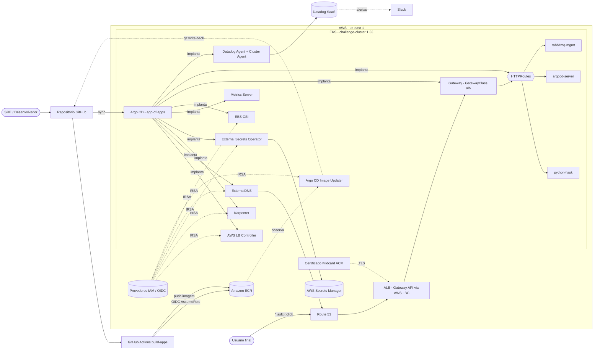

# dd-stack

**Plataforma AWS EKS em estilo produção, entregue de ponta a ponta com Infrastructure-as-Code, GitOps e observabilidade full-stack.**

`dd-stack` provisiona um cluster Amazon EKS do zero com Terraform, sobe um control plane GitOps auto-gerenciado com Argo CD (app-of-apps + sync-waves), expõe as workloads através da **Gateway API** do Kubernetes num ALB da AWS, e envia APM, logs e métricas pro **Datadog** com injeção automática de biblioteca. As imagens dos containers são construídas por um pipeline de CI keyless (OIDC), publicadas no Amazon ECR, e implantadas continuamente pelo Argo CD Image Updater — nenhum `kubectl apply` no caminho de entrega.

<p align="left">
  
  
  
  
  
</p>

---

## Sumário

- [Destaques](#destaques)
- [Arquitetura](#arquitetura)
- [Fluxo de entrega (CI → CD)](#fluxo-de-entrega-ci--cd)
- [Stack técnica](#stack-técnica)
- [Estrutura do repositório](#estrutura-do-repositório)
- [Componentes da plataforma](#componentes-da-plataforma)
- [Aplicações](#aplicações)
- [Como começar](#como-começar)
- [Modelo de segurança](#modelo-de-segurança)
- [Roadmap e limitações conhecidas](#roadmap-e-limitações-conhecidas)

---

## Destaques

- **100% Infrastructure-as-Code** — VPC, EKS, node group, Karpenter, IRSA/OIDC e a confiança de CI do GitHub são todos Terraform, com state remoto em S3 + lock no DynamoDB.
- **GitOps por padrão** — uma única `Application` raiz se ramifica pra todos os componentes de plataforma e workload via padrão **app-of-apps**, com **sync-waves (0 → 3)** garantindo a ordem correta. O Git é a fonte da verdade; drift se auto-corrige.
- **CI keyless** — o GitHub Actions se autentica na AWS via **OIDC** (sem chaves de acesso de longa duração) e publica imagens multi-linguagem no ECR.
- **Entrega contínua sem o pipeline tocar no cluster** — o **Argo CD Image Updater** observa o ECR e faz **git write-back**; o Argo CD reconcilia a mudança. O CI nunca tem credenciais de cluster.
- **Ingress moderno** — **Gateway API** do Kubernetes apoiada no AWS Load Balancer Controller provisiona um ALB internet-facing, com DNS automático (ExternalDNS → Route 53) e TLS (certificado wildcard do ACM).
- **Compute elástico** — o **Karpenter** provisiona nodes com o tamanho certo sob demanda, com consolidação.
- **Observabilidade de primeira classe** — Datadog **Unified Service Tagging** + **auto-instrumentação via admission controller** (bibliotecas de APM injetadas sem tocar no código da app), logs JSON estruturados com correlação de trace, e métricas de negócio customizadas via DogStatsD.
- **Secrets nunca no Git** — o **External Secrets Operator** sincroniza a partir do AWS Secrets Manager via IRSA.

---

## Arquitetura

> O diagrama abaixo é a visão oficial; ele substitui qualquer imagem estática. Renderiza nativamente no GitHub.



**Duas fronteiras de confiança independentes, ambas keyless:**

1. **CI → AWS** via um provedor OIDC dedicado do GitHub e a role IAM `challenge-gha-ecr` (restrita a este repo, somente ECR).
2. **Workloads no cluster → AWS** via o provedor OIDC do EKS e roles **IRSA**, uma por controller (Karpenter, ExternalDNS, LBC, EBS CSI, ESO, Image Updater).

---

## Fluxo de entrega (CI → CD)

```
push em apps/**  ─▶  GitHub Actions (OIDC)  ─▶  build + tag <git-sha>  ─▶  push pro ECR
                                                                              │
                                                                     Argo CD Image Updater
                                                                     detecta o novo build
                                                                              │
                                                                     git write-back
                                                                     (atualiza image.tag em
                                                                      helm/values/*.yaml)
                                                                              │
                                                            Argo CD reconcilia ─▶ rolling update
```

O CI é **apenas build-and-publish** — não tem credencial de Kubernetes nenhuma. A promoção é um commit Git feito pelo Image Updater, mantendo o estado desejado do cluster totalmente descrito no Git.

---

## Stack técnica

| Camada | Tecnologia | Versão |
|---|---|---|
| IaC | Terraform (provider AWS) | `>= 6.8` |
| Kubernetes | Amazon EKS | `1.33` |
| Autoscaling de compute | Karpenter | `1.5.0` |
| GitOps | Argo CD | chart `7.7.5` |
| Entrega contínua | Argo CD Image Updater | chart `1.2.4` |
| Ingress | Gateway API + AWS Load Balancer Controller | CRDs `v1.5.1` / chart LBC `3.4.2` |
| DNS | ExternalDNS | chart `1.16.1` |
| Secrets | External Secrets Operator | chart `0.10.5` |
| Observabilidade | Datadog Agent + Cluster Agent | Helm (`public.ecr.aws/datadog`) |
| Mensageria | RabbitMQ | chart `14.7.0` |
| Web | Apache | chart `11.3.2` |
| CI | GitHub Actions (OIDC → ECR) | — |

---

## Estrutura do repositório

```
dd-stack/
├── terraform/                 # Infrastructure-as-Code (aplicar em ordem)
│   ├── 00-remote-state/       # Bucket S3 de state + tabela de lock no DynamoDB
│   ├── 01-networking/         # VPC 10.0.0.0/20, subnets, IGW, route tables
│   ├── 02-eks-cluster/        # EKS 1.33, node group, IRSA/OIDC, LBC, ExternalDNS, ACM
│   ├── 03-karpenter/          # Karpenter Helm + EC2NodeClass/NodePool
│   └── 04-github-oidc/        # Provedor OIDC do GitHub + role challenge-gha-ecr
├── gitops/                    # Argo CD (app-of-apps, fonte da verdade do GitOps)
│   ├── bootstrap/             # Instalação única do Argo CD + app raiz
│   ├── root-app.yaml          # Application raiz → gitops/registry (recursivo)
│   ├── registry/               # Uma Application por componente (com sync-wave)
│   ├── external-secrets/      # ClusterSecretStore + ExternalSecret
│   ├── gateway/ gateway-crds/ gateway-routes/   # Objetos e rotas da Gateway API
│   └── image-updater/         # Configuração do Argo CD Image Updater
├── apps/                      # Código-fonte dos microsserviços
│   ├── python/                # API Flask "Symbol Prices" (serviço de referência)
│   ├── java/                  # Serviço Spring Boot
│   ├── dotnet/                # API de Todo em ASP.NET Core
│   └── _traffic/              # Gerador de carga
├── helm/                      # Chart genérico de app + values por app
│   ├── app/                   # Deployment/Service/PDB com UST do Datadog
│   └── values/                # python.yaml / java.yaml / dotnet.yaml
├── datadog/                   # Values do Helm do Datadog Agent
├── docs/architecture/         # Diagrama de fluxo (fonte .drawio)
└── .github/workflows/         # build-apps.yml (OIDC → ECR)
```

---

## Componentes da plataforma

### Infraestrutura (Terraform)
Cinco módulos ordenados. O `00-remote-state` sobe o backend S3 + DynamoDB; todo módulo seguinte guarda seu state lá, em `challenge/<módulo>/terraform.tfstate`. O `01-networking` constrói uma VPC `10.0.0.0/20` em duas AZs (us-east-1a/1b). O `02-eks-cluster` sobe o EKS `1.33` (auth via API + ConfigMap, todos os logs do control plane habilitados), um node group gerenciado em SPOT, o provedor OIDC do EKS pra IRSA, os add-ons **EBS CSI** e **Metrics Server**, e — via o provider Helm do Terraform — o **AWS Load Balancer Controller** e o **ExternalDNS**. Ele também solicita o certificado wildcard do **ACM** para `*.asfcjr.click`. O `03-karpenter` instala o Karpenter e seu `EC2NodeClass`/`NodePool` (famílias `m`/`t` on-demand, multi-AZ, expiração de node em 8h, consolidação). O `04-github-oidc` monta a confiança do CI.

### Control plane GitOps (Argo CD)
O `gitops/bootstrap` instala o Argo CD uma única vez, depois aplica uma `Application` **raiz** que aponta pra `gitops/registry/` e recursa — o padrão **app-of-apps**. Cada filha é anotada com um **sync-wave** pra garantir que as dependências entrem primeiro:

| Wave | Componentes |
|---|---|
| **0** | External Secrets Operator, Argo CD Image Updater, CRDs da Gateway API |
| **1** | Gateway + LoadBalancerConfiguration, config do ExternalSecret, config do Image Updater |
| **2** | Apache, RabbitMQ, app python-flask |
| **3** | HTTPRoutes |

Todas as apps usam sync automático com prune + self-heal, então o cluster converge continuamente pro Git.

### Rede e ingress (Gateway API)
Uma `GatewayClass` (`alb`, controller `gateway.k8s.aws/alb`) e um `Gateway` chamado `public` provisionam um ALB internet-facing. Os listeners atendem HTTP:80 e HTTPS:443 para `*.asfcjr.click`, com o certificado do ACM acoplado via `LoadBalancerConfiguration`. As `HTTPRoute`s mapeiam hostnames pra serviços:

| Hostname | Serviço |
|---|---|
| `python.asfcjr.click` | python-flask |
| `argocd.asfcjr.click` | argocd-server |
| `rabbitmq.asfcjr.click` | rabbitmq (UI de management) |

O ExternalDNS reconcilia esses hostnames no Route 53 automaticamente.

### Observabilidade (Datadog)
O Datadog Agent + Cluster Agent são implantados com os agentes de **logs** (coleta tudo), **APM**, **process** e **cluster-checks**, o **orchestrator explorer**, e o **admission controller**. Como o chart genérico das apps já carimba o **Unified Service Tagging** (`env`/`service`/`version`) e as annotations `admission.datadoghq.com/*`, o Datadog **injeta a biblioteca de tracing automaticamente** por linguagem — sem mudar nada no código da aplicação. O serviço Python de referência adiciona logs JSON estruturados com **correlação de trace-id** e métricas de negócio customizadas (`orders.placed`, `orders.value_usd`) via DogStatsD. Checks de terceiros (Apache `server-status`, plugin Prometheus do RabbitMQ, `/metrics` do Karpenter) são conectados via annotations no pod.

### CI/CD
O `build-apps.yml` dispara em pushes dentro de `apps/**`. Ele assume a role `challenge-gha-ecr` via **OIDC**, faz login no ECR, e builda os três serviços em uma matrix, taggeando cada imagem com o SHA de 7 caracteres do commit. O deploy é intencionalmente **fora** do CI — o Argo CD Image Updater é o dono da promoção.

---

## Aplicações

| Serviço | Stack | Papel | Exposto em |
|---|---|---|---|
| **python-flask** | Python 3.9 · Flask | API de referência "Symbol Prices" (dados de mercado) com instrumentação Datadog rica (spans simulados de DB/cache/upstream, taxas de erro realistas, métricas customizadas) | `python.asfcjr.click` |
| **java-spring** | Java 11 · Spring Boot 2.6 | Serviço de saudação com chamadas de saída (tracing distribuído) | buildado pelo CI |
| **dotnet-todoapi** | .NET 5 · ASP.NET Core | API CRUD de Todo (EF Core InMemory) | buildado pelo CI |

> O serviço Python é a referência GitOps totalmente conectada (implantado, roteado e entregue continuamente via Image Updater). Java e .NET são buildados e publicados pelo CI; a conexão GitOps deles está no roadmap abaixo.

---

## Como começar

**Pré-requisitos:** conta AWS, uma hosted zone do Route 53 pro seu domínio, Terraform, `kubectl`, `helm`, e a AWS CLI.

```bash
# 1) Bootstrap do state remoto (state local, roda uma vez)
cd terraform/00-remote-state && terraform init && terraform apply

# 2) Networking → EKS → Karpenter → GitHub OIDC (em ordem)
cd ../01-networking   && terraform init && terraform apply
cd ../02-eks-cluster  && terraform init && terraform apply
cd ../03-karpenter    && terraform init && terraform apply
cd ../04-github-oidc  && terraform init && terraform apply   # gera o output gha_role_arn

# 3) Aponta o kubectl pro cluster
aws eks update-kubeconfig --name challenge-cluster --region us-east-1

# 4) Bootstrap do control plane GitOps (instala o Argo CD + app raiz)
./gitops/bootstrap/bootstrap.sh

# 5) Observabilidade (Helm fora do GitOps; API key vem de um datadog-secret pré-criado)
helm upgrade --install datadog datadog/datadog \
  -n datadog --create-namespace -f datadog/datadog-values.yaml
```

Configure o secret `AWS_ROLE_ARN` do CI com o output `gha_role_arn`. O Argo CD então converge o resto da plataforma automaticamente.

---

## Modelo de segurança

- **Nenhuma credencial estática de nuvem em lugar nenhum.** O CI usa GitHub OIDC; os controllers no cluster usam IRSA. Cada role tem o mínimo privilégio necessário e um único propósito.
- **Secrets ficam no AWS Secrets Manager** e são projetados no cluster sob demanda pelo External Secrets Operator — nunca commitados no Git.
- **TLS em toda a borda** via certificado wildcard gerenciado pelo ACM no ALB.
- **Logging de auditoria completo do control plane** do EKS habilitado.
- **Tags de imagem imutáveis** (SHA do commit) com trilha de promoção auditável no Git através do Image Updater.

---

## Roadmap e limitações conhecidas

Estado honesto da plataforma e próximas iterações:

- **Implantar Java e .NET via GitOps** — ambos já são buildados e publicados hoje; falta adicionar as `Application`s do Argo CD, `HTTPRoute`s e a conexão com o Image Updater deles, seguindo a referência do Python.
- **Monitors e SLOs como código** — os monitors, SLOs e o canal de notificação do **Slack** do Datadog estão hoje configurados na UI do Datadog; codificar isso (provider Datadog do Terraform) pra deixar o alerting versionado e reproduzível.
- **Gerenciar o Datadog via GitOps** — o Agent é instalado fora do fluxo GitOps via Helm; incorporar ao app-of-apps pra ter uma única fonte da verdade.
- **Subnets privadas de node + saída via NAT** — o cluster hoje roda em subnets públicas com NAT desabilitado pra minimizar custo do desafio; mover as workloads pra subnets privadas com NAT (ou VPC endpoints) pra uma postura de produção.
- **Reabilitar os admission webhooks** — os releases Helm do LBC/ExternalDNS/Karpenter desabilitam webhooks pra simplificar a ordem do primeiro apply; reabilitar pra validação completa.

---

<sub>Construído como um desafio hands-on de platform engineering em EKS — Terraform · Argo CD · Gateway API · Karpenter · Datadog · GitHub Actions (OIDC).</sub>
